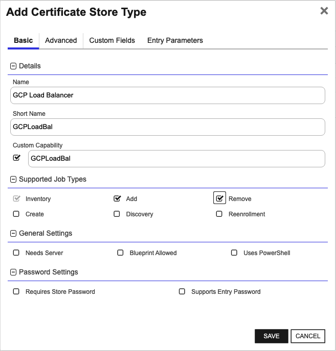
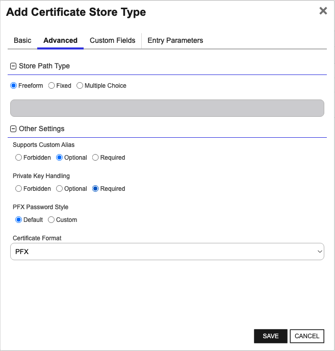
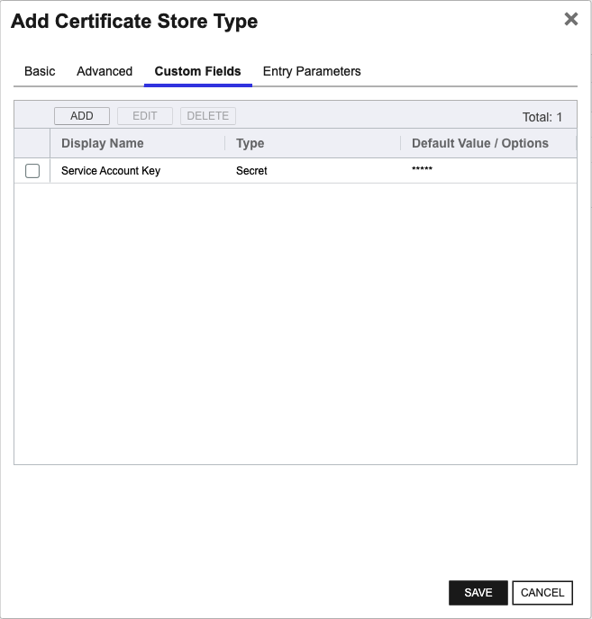

<h1 align="center" style="border-bottom: none">
    GCP Load Balancer Universal Orchestrator Extension
</h1>

<p align="center">
  <!-- Badges -->

<a href="https://github.com/Keyfactor/gcp-loadbalancer-orchestrator/releases"></a>


</p>

<p align="center">
  <!-- TOC -->
  <a href="#support">
    <b>Support</b>
  </a>
  ·
  <a href="#installation">
    <b>Installation</b>
  </a>
  ·
  <a href="#license">
    <b>License</b>
  </a>
  ·
  <a href="https://github.com/orgs/Keyfactor/repositories?q=orchestrator">
    <b>Related Integrations</b>
  </a>
</p>

## Overview

The Google Cloud Platform (GCP) Load Balancer Orchestrator allows for the management of Google Cloud Platform Load Balancer certificate stores. Inventory, Management-Add, and Management-Remove functions are supported. Also, re-binding to endpoints IS supported for certificate renewals (but NOT adding new certificates). The orchestrator uses the Google Cloud Compute Engine API (https://cloud.google.com/compute/docs/reference/rest/v1) to manage stores.


## Compatibility

This integration is compatible with Keyfactor Universal Orchestrator version 10.1 and later.

## Support
The GCP Load Balancer Universal Orchestrator extension If you have a support issue, please open a support ticket by either contacting your Keyfactor representative or via the Keyfactor Support Portal at https://support.keyfactor.com. 
 
> To report a problem or suggest a new feature, use the **[Issues](../../issues)** tab. If you want to contribute actual bug fixes or proposed enhancements, use the **[Pull requests](../../pulls)** tab.

## Requirements & Prerequisites

Before installing the GCP Load Balancer Universal Orchestrator extension, we recommend that you install [kfutil](https://github.com/Keyfactor/kfutil). Kfutil is a command-line tool that simplifies the process of creating store types, installing extensions, and instantiating certificate stores in Keyfactor Command.


The orchestrator extension supports having credentials provided by the environment, environment variable, or passed manually from Keyfactor Command.  You can read more about the first two options [here](https://cloud.google.com/docs/authentication/production#automatically).

To pass credentials from Keyfactor Command you need to first create a service account within GCP and then download a [service account key](https://cloud.google.com/docs/authentication/set-up-adc-local-dev-environment#local-key)  Remember to assign the appropriate role/permissions for the service account (see below).  Afterwards inside Keyfactor Command copy and paste the contents of the service account key in the password field for the GCP Certificate Store you create.

The following are the required permissions for the GCP service account:
- compute.sslCertificates.create
- compute.sslCertificates.delete
- compute.sslCertificates.list
- compute.sslCertificates.get
- compute.targetHttpsProxies.list
- compute.targetHttpsProxies.setSslCertificates
- compute.regionSslCertificates.list


## Create the GCPLoadBal Certificate Store Type

To use the GCP Load Balancer Universal Orchestrator extension, you **must** create the GCPLoadBal Certificate Store Type. This only needs to happen _once_ per Keyfactor Command instance.


* **Create GCPLoadBal using kfutil**:

    ```shell
    # GCP Load Balancer
    kfutil store-types create GCPLoadBal
    ```

* **Create GCPLoadBal manually in the Command UI**:
    <details><summary>Create GCPLoadBal manually in the Command UI</summary>

    Create a store type called `GCPLoadBal` with the attributes in the tables below:

    #### Basic Tab
    | Attribute | Value | Description |
    | --------- | ----- | ----- |
    | Name | GCP Load Balancer | Display name for the store type (may be customized) |
    | Short Name | GCPLoadBal | Short display name for the store type |
    | Capability | GCPLoadBal | Store type name orchestrator will register with. Check the box to allow entry of value |
    | Supports Add | ✅ Checked | Check the box. Indicates that the Store Type supports Management Add |
    | Supports Remove | ✅ Checked | Check the box. Indicates that the Store Type supports Management Remove |
    | Supports Discovery | 🔲 Unchecked |  Indicates that the Store Type supports Discovery |
    | Supports Reenrollment | 🔲 Unchecked |  Indicates that the Store Type supports Reenrollment |
    | Supports Create | 🔲 Unchecked |  Indicates that the Store Type supports store creation |
    | Needs Server | 🔲 Unchecked | Determines if a target server name is required when creating store |
    | Blueprint Allowed | 🔲 Unchecked | Determines if store type may be included in an Orchestrator blueprint |
    | Uses PowerShell | 🔲 Unchecked | Determines if underlying implementation is PowerShell |
    | Requires Store Password | 🔲 Unchecked | Enables users to optionally specify a store password when defining a Certificate Store. |
    | Supports Entry Password | 🔲 Unchecked | Determines if an individual entry within a store can have a password. |

    The Basic tab should look like this:

    

    #### Advanced Tab
    | Attribute | Value | Description |
    | --------- | ----- | ----- |
    | Supports Custom Alias | Optional | Determines if an individual entry within a store can have a custom Alias. |
    | Private Key Handling | Required | This determines if Keyfactor can send the private key associated with a certificate to the store. Required because IIS certificates without private keys would be invalid. |
    | PFX Password Style | Default | 'Default' - PFX password is randomly generated, 'Custom' - PFX password may be specified when the enrollment job is created (Requires the Allow Custom Password application setting to be enabled.) |

    The Advanced tab should look like this:

    

    > For Keyfactor **Command versions 24.4 and later**, a Certificate Format dropdown is available with PFX and PEM options. Ensure that **PFX** is selected, as this determines the format of new and renewed certificates sent to the Orchestrator during a Management job. Currently, all Keyfactor-supported Orchestrator extensions support only PFX.

    #### Custom Fields Tab
    Custom fields operate at the certificate store level and are used to control how the orchestrator connects to the remote target server containing the certificate store to be managed. The following custom fields should be added to the store type:

    | Name | Display Name | Description | Type | Default Value/Options | Required |
    | ---- | ------------ | ---- | --------------------- | -------- | ----------- |
    | jsonKey | Service Account Key | If authenticating by passing credentials from Keyfactor Command, this is the JSON-based service account key created from within Google Cloud.  If authenticating via Application Default Credentials (ADC), select No Value | Secret |  | ✅ Checked |

    The Custom Fields tab should look like this:

    


    </details>

## Installation

1. **Download the latest GCP Load Balancer Universal Orchestrator extension from GitHub.** 

    Navigate to the [GCP Load Balancer Universal Orchestrator extension GitHub version page](https://github.com/Keyfactor/gcp-loadbalancer-orchestrator/releases/latest). Refer to the compatibility matrix below to determine whether the `net6.0` or `net8.0` asset should be downloaded. Then, click the corresponding asset to download the zip archive.
    | Universal Orchestrator Version | Latest .NET version installed on the Universal Orchestrator server | `rollForward` condition in `Orchestrator.runtimeconfig.json` | `gcp-loadbalancer-orchestrator` .NET version to download |
    | --------- | ----------- | ----------- | ----------- |
    | Older than `11.0.0` | | | `net6.0` |
    | Between `11.0.0` and `11.5.1` (inclusive) | `net6.0` | | `net6.0` | 
    | Between `11.0.0` and `11.5.1` (inclusive) | `net8.0` | `Disable` | `net6.0` | 
    | Between `11.0.0` and `11.5.1` (inclusive) | `net8.0` | `LatestMajor` | `net8.0` | 
    | `11.6` _and_ newer | `net8.0` | | `net8.0` |

    Unzip the archive containing extension assemblies to a known location.

    > **Note** If you don't see an asset with a corresponding .NET version, you should always assume that it was compiled for `net6.0`.

2. **Locate the Universal Orchestrator extensions directory.**

    * **Default on Windows** - `C:\Program Files\Keyfactor\Keyfactor Orchestrator\extensions`
    * **Default on Linux** - `/opt/keyfactor/orchestrator/extensions`
    
3. **Create a new directory for the GCP Load Balancer Universal Orchestrator extension inside the extensions directory.**
        
    Create a new directory called `gcp-loadbalancer-orchestrator`.
    > The directory name does not need to match any names used elsewhere; it just has to be unique within the extensions directory.

4. **Copy the contents of the downloaded and unzipped assemblies from __step 2__ to the `gcp-loadbalancer-orchestrator` directory.**

5. **Restart the Universal Orchestrator service.**

    Refer to [Starting/Restarting the Universal Orchestrator service](https://software.keyfactor.com/Core-OnPrem/Current/Content/InstallingAgents/NetCoreOrchestrator/StarttheService.htm).


> The above installation steps can be supplimented by the [official Command documentation](https://software.keyfactor.com/Core-OnPrem/Current/Content/InstallingAgents/NetCoreOrchestrator/CustomExtensions.htm?Highlight=extensions).


## Defining Certificate Stores


* **Manually with the Command UI**

    <details><summary>Create Certificate Stores manually in the UI</summary>

    1. **Navigate to the _Certificate Stores_ page in Keyfactor Command.**

        Log into Keyfactor Command, toggle the _Locations_ dropdown, and click _Certificate Stores_.

    2. **Add a Certificate Store.**

        Click the Add button to add a new Certificate Store. Use the table below to populate the **Attributes** in the **Add** form.
        | Attribute | Description |
        | --------- | ----------- |
        | Category | Select "GCP Load Balancer" or the customized certificate store name from the previous step. |
        | Container | Optional container to associate certificate store with. |
        | Client Machine | Not used, but required when creating a store.  Just enter any value. |
        | Store Path | Your Google Cloud Project ID only if you choose to use global resources.  Append a forward slash '/' and valid GCP region to process against a specific [GCP region](https://gist.github.com/rpkim/084046e02fd8c452ba6ddef3a61d5d59). |
        | Orchestrator | Select an approved orchestrator capable of managing `GCPLoadBal` certificates. Specifically, one with the `GCPLoadBal` capability. |
        | jsonKey | If authenticating by passing credentials from Keyfactor Command, this is the JSON-based service account key created from within Google Cloud.  If authenticating via Application Default Credentials (ADC), select No Value |


        

    </details>

* **Using kfutil**
    
    <details><summary>Create Certificate Stores with kfutil</summary>
    
    1. **Generate a CSV template for the GCPLoadBal certificate store**

        ```shell
        kfutil stores import generate-template --store-type-name GCPLoadBal --outpath GCPLoadBal.csv
        ```
    2. **Populate the generated CSV file**

        Open the CSV file, and reference the table below to populate parameters for each **Attribute**.
        | Attribute | Description |
        | --------- | ----------- |
        | Category | Select "GCP Load Balancer" or the customized certificate store name from the previous step. |
        | Container | Optional container to associate certificate store with. |
        | Client Machine | Not used, but required when creating a store.  Just enter any value. |
        | Store Path | Your Google Cloud Project ID only if you choose to use global resources.  Append a forward slash '/' and valid GCP region to process against a specific [GCP region](https://gist.github.com/rpkim/084046e02fd8c452ba6ddef3a61d5d59). |
        | Orchestrator | Select an approved orchestrator capable of managing `GCPLoadBal` certificates. Specifically, one with the `GCPLoadBal` capability. |
        | jsonKey | If authenticating by passing credentials from Keyfactor Command, this is the JSON-based service account key created from within Google Cloud.  If authenticating via Application Default Credentials (ADC), select No Value |


        

    3. **Import the CSV file to create the certificate stores** 

        ```shell
        kfutil stores import csv --store-type-name GCPLoadBal --file GCPLoadBal.csv
        ```
    </details>

> The content in this section can be supplimented by the [official Command documentation](https://software.keyfactor.com/Core-OnPrem/Current/Content/ReferenceGuide/Certificate%20Stores.htm?Highlight=certificate%20store).


## License

Apache License 2.0, see [LICENSE](LICENSE).

## Related Integrations

See all [Keyfactor Universal Orchestrator extensions](https://github.com/orgs/Keyfactor/repositories?q=orchestrator).