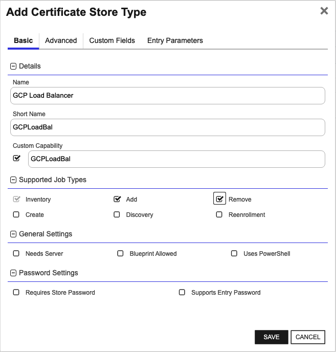

## GCP Load Balancer

The GCP Load Balancer Certificate Store Type in Keyfactor Command facilitates the management of SSL/TLS certificates specifically for GCP Load Balancers. This store type allows administrators to organize and handle certificates efficiently within the GCP ecosystem.

### Functions and Representation

The Certificate Store Type represents the logical grouping of certificates associated with specific GCP projects or regions. It supports three main job types: Inventory, Management Add, and Management Remove. These capabilities ensure that certificates can be discovered, added, and removed seamlessly within the GCP environment.

### Authentication and Parameters

To authenticate and interact with GCP, the Certificate Store Type utilizes a GCP service account key, which can be passed directly from Keyfactor Command. You can configure this using a specific custom parameter (`jsonKey`) when creating the Certificate Store Type. The store type expects a JSON-based service account key for authentication.

### Limitations and Considerations

When creating a Certificate Store in Keyfactor Command, it is essential to appropriately configure parameters such as the GCP project ID and region, along with the authentication details. The private key handling is required for adding certificates, as adding a certificate without its private key is not a valid use case for GCP Load Balancers.

### SDK and Caveats

While the readme does not explicitly mention an SDK, it relies on the GCP API for various operations such as listing, creating, and deleting certificates, as well as associating them with load balancers.

This store type does not have intricate caveats but requires careful configuration of credentials and parameters to ensure smooth operation. Additionally, interaction with GCP services mandates appropriate permissions for the service account used.


### Supported Job Types

| Job Name | Supported |
| -------- | --------- |
| Inventory | ✅ |
| Management Add | ✅ |
| Management Remove | ✅ |
| Discovery |  |
| Create |  |
| Reenrollment |  |

## Requirements

### GCP Load Balancer Configuration

**1. In Keyfactor Command, go to Settings (the gear icon in the top right) => Certificate Store Types and create a new certificate store type:**


The certificate store type set up for the GCP Load Balancer Orchestrator should have the following options set:

- **Name:** A descriptive name for the certificate store type
- **Short Name:** Must be **GCPLoadBal** or the alternative name you used to create the folder in the {installation folder}\extensions folder.
- **Custom Capability** - Leave unchecked
- **Supported Job Types** – Select Inventory, Add, and Remove
- **General Settings** - Leave Needs Server and Uses PowerShell unchecked.  Select Blueprint Allowed if you plan to use blueprinting.
- **Password Settings** - Leave both options unchecked
- **Store Path Type** - Freeform
- **Supports Custom Alias** - Optional.  If no alias is provided, one will be dynamically created by the GCP Load Balancer Orchestrator.
- **Private Key Handling: ** Required (Adding a certificate to a GCP Load Balancer certificate store without the private key is not a valid use case)
- **PFX Password Style:** Default

**Parameters:** Add 1 custom parameter if authenticating to the GCP API library by passing the GCP service account key from Keyfactor Command (see Authentication):


- Name: Must be **jsonKey**
- Display Name: Desired custom display name
- Type: Secret
- Change Default Value: Unchecked
- Default Value: Leave blank


**2. Create a new GCP Load Balancer certificate store.  Navigate to Certificate Locations =\> Certificate Stores within Keyfactor Command to add the store. Below are the values that should be entered.**


- **Category:** Must be the GCP Load Balancer type you created in Step 1.

- **Container:** Optional container name if using this feature.  Please consult the Keyfactor Command Reference Guide for more information on this feature.

- **Client Machine:** The name or IP address of the Orchestrator server that will be handling GCP jobs.

- **Store Path:** This should be your Google Cloud project ID.  This will work against GCP Global resources.  Optionally, you can append "/" with the region you wish to process against.  Please refer to the following page for a list of valid region codes (GCP code column): https://gist.github.com/rpkim/084046e02fd8c452ba6ddef3a61d5d59.

- **Service Account Key:** If you will be authenticating via passing credentials from Keyfactor Command, you must add this value as follows:
  - No Service Account Key: Unchecked
  - Secret Source: "Keyfactor Secrets" if you wish to store the GCP service account key in the Keyfactor secrets engine or "Load From PAM Provider" if you have set up a PAM provider integration within Keyfactor Command and wish to store this value there.
  - Enter and Confirm Service Account Key: The JSON-based service account key you acquired from GCP (See Authentication).

**Inventory Schedule:** Set whether to schedule Inventory jobs for this certificate store, and if so, the frequency here.

### Authentication

A service account is necessary for authentication to GCP.  The following are the required permissions:
- compute.sslCertificates.create
- compute.sslCertificates.delete
- compute.sslCertificates.list
- compute.sslCertificates.get
- compute.targetHttpsProxies.list
- compute.targetHttpsProxies.setSslCertificates
- compute.regionSslCertificates.list

The agent supports having credentials provided by the environment, environment variable, or passed manually from Keyfactor Command.  You can read more about the first two options [here] (https://cloud.google.com/docs/authentication/production#automatically).

To pass credentials from Keyfactor Command you need to first create a service account and then download a service account key.  Instructions are [here](https://cloud.google.com/docs/authentication/production#manually).  Remember to assign the appropriate role/permissions for the service account.  Afterwards inside Keyfactor Command copy and paste the contents of the service account key in the password field for the GCP Certificate Store Type.


## Certificate Store Type Configuration

The recommended method for creating the `GCPLoadBal` Certificate Store Type is to use [kfutil](https://github.com/Keyfactor/kfutil). After installing, use the following command to create the `` Certificate Store Type:

```shell
kfutil store-types create GCPLoadBal
```

<details><summary>GCPLoadBal</summary>

Create a store type called `GCPLoadBal` with the attributes in the tables below:

### Basic Tab
| Attribute | Value | Description |
| --------- | ----- | ----- |
| Name | GCP Load Balancer | Display name for the store type (may be customized) |
| Short Name | GCPLoadBal | Short display name for the store type |
| Capability | GCPLoadBal | Store type name orchestrator will register with. Check the box to allow entry of value |
| Supported Job Types (check the box for each) | Add, Discovery, Remove | Job types the extension supports |
| Supports Add | ✅ | Check the box. Indicates that the Store Type supports Management Add |
| Supports Remove | ✅ | Check the box. Indicates that the Store Type supports Management Remove |
| Supports Discovery |  |  Indicates that the Store Type supports Discovery |
| Supports Reenrollment |  |  Indicates that the Store Type supports Reenrollment |
| Supports Create |  |  Indicates that the Store Type supports store creation |
| Needs Server |  | Determines if a target server name is required when creating store |
| Blueprint Allowed |  | Determines if store type may be included in an Orchestrator blueprint |
| Uses PowerShell |  | Determines if underlying implementation is PowerShell |
| Requires Store Password |  | Determines if a store password is required when configuring an individual store. |
| Supports Entry Password |  | Determines if an individual entry within a store can have a password. |

The Basic tab should look like this:



### Advanced Tab
| Attribute | Value | Description |
| --------- | ----- | ----- |
| Supports Custom Alias | Optional | Determines if an individual entry within a store can have a custom Alias. |
| Private Key Handling | Required | This determines if Keyfactor can send the private key associated with a certificate to the store. Required because IIS certificates without private keys would be invalid. |
| PFX Password Style | Default | 'Default' - PFX password is randomly generated, 'Custom' - PFX password may be specified when the enrollment job is created (Requires the Allow Custom Password application setting to be enabled.) |

The Advanced tab should look like this:


### Custom Fields Tab
Custom fields operate at the certificate store level and are used to control how the orchestrator connects to the remote target server containing the certificate store to be managed. The following custom fields should be added to the store type:

| Name | Display Name | Type | Default Value/Options | Required | Description |
| ---- | ------------ | ---- | --------------------- | -------- | ----------- |


The Custom Fields tab should look like this:


</details>

## Certificate Store Configuration

After creating the `GCPLoadBal` Certificate Store Type and installing the GCP Load Balancer Universal Orchestrator extension, you can create new [Certificate Stores](https://software.keyfactor.com/Core-OnPrem/Current/Content/ReferenceGuide/Certificate%20Stores.htm?Highlight=certificate%20store) to manage certificates in the remote platform.

The following table describes the required and optional fields for the `GCPLoadBal` certificate store type.

| Attribute | Description | Attribute is PAM Eligible |
| --------- | ----------- | ------------------------- |
| Category | Select "GCP Load Balancer" or the customized certificate store name from the previous step. | |
| Container | Optional container to associate certificate store with. | |
| Client Machine | For the Client Machine field, enter the name or IP address of the Orchestrator server that will handle the jobs for the GCP Load Balancer. For example, you might enter 'orchestrator.example.local' or '192.168.0.1'. | |
| Store Path | For the Store Path field, enter your Google Cloud project ID. Optionally, you can append a region to the project ID, separated by a '/', to specify a particular region. For example, 'my-gcp-project' or 'my-gcp-project/us-central1'. | |
| Orchestrator | Select an approved orchestrator capable of managing `GCPLoadBal` certificates. Specifically, one with the `GCPLoadBal` capability. | |

* **Using kfutil**

    ```shell
    # Generate a CSV template for the AzureApp certificate store
    kfutil stores import generate-template --store-type-name GCPLoadBal --outpath GCPLoadBal.csv

    # Open the CSV file and fill in the required fields for each certificate store.

    # Import the CSV file to create the certificate stores
    kfutil stores import csv --store-type-name GCPLoadBal --file GCPLoadBal.csv
    ```

* **Manually with the Command UI**: In Keyfactor Command, navigate to Certificate Stores from the Locations Menu. Click the Add button to create a new Certificate Store using the attributes in the table above.