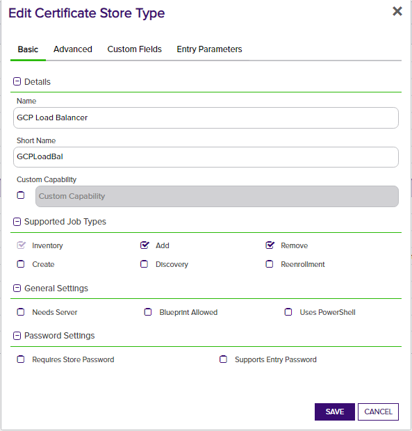
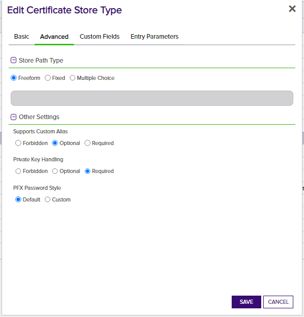
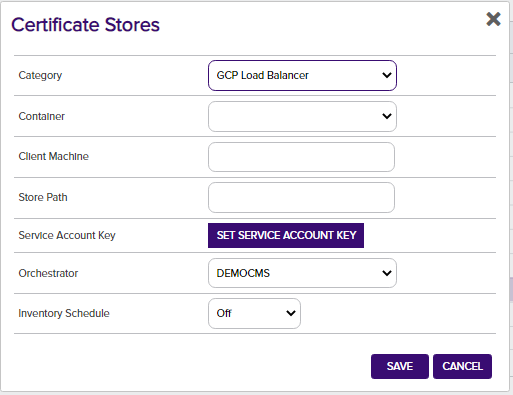

***

# Introduction 
- {{ description }}

# Use Cases

The GCP Load Balancer Orchestrator supports the following capabilities:

- Inventory
- Management (Add)
- Management (Remove)

# Versioning

The version number of a the GCP Load Balancer Orchestrator can be verified by right clicking on the GCPLoadBalancer.dll file, selecting Properties, and then clicking on the Details tab.

# Keyfactor Version Supported

The F5 Orchestrator has been tested using Keyfactor Command version 9.4 and the Keyfactor Universal Orchestrator version 9.5.  However, this should be compatible with any Keyfactor versions 9.x and above.

# GCP Load Balancer Orchestrator Installation

1. In the Keyfactor Orchestrator installation folder (by convention C:\Program Files\Keyfactor\Keyfactor Orchestrator), find the "extensions" folder. Underneath that, create a new folder named "GCPLoadBal".  You may choose a different folder name if you want, but when you get to GCP Load Balancer Configuration - Step 1, the Short Name you choose must match this folder name.  Also, the folder name must be a maximum of 10 characters long.
2. Download the latest version of the GCP Load Balancer Orchestrator from [GitHub](https://github.com/Keyfactor/gcp-loadbalancer-orchestrator).
3. Copy the contents of the download installation zip file to the folder created in Step 1.
4. (Optional) If you decided to name of the folder in step 1 to something different than the suggested name - GCPLoadBal - you will need to edit the manifest.json file.  For each section, change {folder name} in "CertStores.{folder name}.*Capability*" to the folder name you used for the store type.  

# GCP Load Balancer Configuration

**1. In Keyfactor Command, go to Settings (the gear icon in the top right) => Certificate Store Types and create a new certificate store type:**

The certificate store type set up for the GCP Load Balancer Orchestrator should have the following options set:

- **Name:** A descriptive name for the certificate store type
- **Short Name:** Must be **GCPLoadBal** or the alternative name you used to create the folder in the {installation folder}\extensions folder.
- **Custom Capability** - Leave unchecked
- **Supported Job Types** – Select Inventory, Add, and Remove
- **General Settings** - Leave Needs Server and Uses PowerShell unchecked.  Select Blueprint Allowed if you plan to use blueprinting.
- **Password Settings** - Leave both options unchecked
- **Store Path Type** - Freeform
- **Supports Custom Alias** - Optional.  If no alias is provided, one will be dynamically created by the GCP Load Balancer Orchestrator.
- **Private Key Handling: ** Required (Adding a certificate to a GCP Load Balancer certificate store without the private key is not a valid use case)
- **PFX Password Style:** Default

**Parameters:** Add 1 custom parameter if authenticating to the GCP API library by passing the GCP service account key from Keyfactor Command (see Authentication):

- Name: Must be **jsonKey**
- Display Name: Desired custom display name
- Type: Secret
- Change Default Value: Unchecked
- Default Value: Leave blank

**2. Create a new GCP Load Balancer certificate store.  Navigate to Certificate Locations =\> Certificate Stores within Keyfactor Command to add the store. Below are the values that should be entered.**

- **Category:** Must be the GCP Load Balancer type you created in Step 1.

- **Container:** Optional container name if using this feature.  Please consult the Keyfactor Command Reference Guide for more information on this feature.

- **Client Machine:** The name or IP address of the Orchestrator server that will be handling GCP jobs.

- **Store Path:** This should be your Google Cloud project ID.  This will work against GCP Global resources.  Optionally, you can append "/" with the region you wish to process against.  Please refer to the following page for a list of valid region codes (GCP code column): https://gist.github.com/rpkim/084046e02fd8c452ba6ddef3a61d5d59.

- **Service Account Key:** If you will be authenticating via passing credentials from Keyfactor Command, you must add this value as follows:
  - No Service Account Key: Unchecked
  - Secret Source: "Keyfactor Secrets" if you wish to store the GCP service account key in the Keyfactor secrets engine or "Load From PAM Provider" if you have set up a PAM provider integration within Keyfactor Command and wish to store this value there.
  - Enter and Confirm Service Account Key: The JSON-based service account key you acquired from GCP (See Authentication).

**Inventory Schedule:** Set whether to schedule Inventory jobs for this certificate store, and if so, the frequency here.

# Authentication

A service account is necessary for authentication to GCP.  The following are the required permissions:
- compute.sslCertificates.create
- compute.sslCertificates.delete
- compute.sslCertificates.list

The agent supports having credentials provided by the environment, environment variable, or passed manually from Keyfactor Command.  You can read more about the first two options [here] (https://cloud.google.com/docs/authentication/production#automatically).

To pass credentials from Keyfactor Command you need to first create a service account and then download a service account key.  Instructions are [here](https://cloud.google.com/docs/authentication/production#manually).  Remember to assign the appropriate role/permissions for the service account.  Afterwards inside Keyfactor Command copy and paste the contents of the service account key in the password field for the GCP Certificate Store Type.
